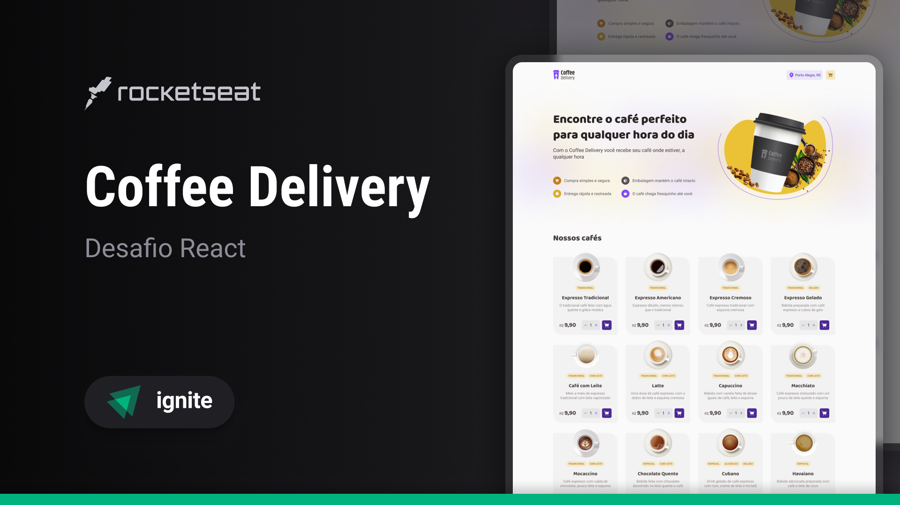

# ☕ Coffee Delivery

Neste projeto, aprofundei meus conhecimentos em React, TypeScript e Single Page Application (SPA), aplicando recursos avançados como React Hook Form, validação com Zod, requisições de API com fetch e estilização em CSS. Essas experiências fortaleceram minhas habilidades práticas nessas tecnologias, contribuindo para a criação eficiente de aplicações robustas.

Confira a execução do ☕ [Coffee Delivery][deploy].

## 🚀 Começando

* Consulte **[Instalação](#-instalação)** para clonar e configurar o projeto;
* Consulte **[Como Iniciar o Projeto](#-como-iniciar-o-projeto)** para saber como iniciar o projeto;
* Consulte **[Tecnologias Utilizadas](#%EF%B8%8F-tecnologias-utilizadas)** para conhecer as tecnologias utilizadas.

### 📋 Pré-requisitos
Necessita de `Node.js v20+` para rodar. Verifique a versão do Nodejs instalada na sua máquina.

```bash
node --version
```

Você receberá a seguinte mensagem após executar o comando, indicando a sua versão do Node.js.
```bash
v20.7.0
```

### 🔧 Instalação

Caso não seja identificado o ``Nodejs``, instale a **versão LTS** [clicando aqui](https://nodejs.org/en)

Clone este repositório para o seu ambiente local:
```bash
git clone https://github.com/Wellington-Henrique/desafio-coffee-delivery-rockectseat-reactjs-ts.git
```

Instale as dependências do projeto:
```bash
npm i
```

## 📦 Como Iniciar o Projeto

Abra a pasta do projeto no seu editor favorito.

.**..ou utilize o seguinte comando na raiz do projeto se tiver o Visual Code instalado**:
```bash
code .
```

Utilize a API presente no projeto, ou inicie o servidor de teste com o seguinte comando:
```bash
npm run server
```

Inicie a aplicação:
```bash
npm run dev
```

A aplicação iniciará em modo de desenvolvimento. [Clique aqui](http://localhost:5173/) para visualizar a aplicação no seu navegador. Normalmente o **vite** utiliza a porta **5173**.

## 🛠️ Tecnologias Utilizadas

* ⚡ [Vite](https://vitejs.dev/): Um construtor de aplicações JavaScript rápido e flexível;
* 💅 [Styled Components](https://styled-components.com/): Biblioteca de estilização em formato *js/*ts;
* 🚨 [ESLint](https://eslint.org/): Mantém a padronização do código;
* 🌐 [React Router Dom](https://www.npmjs.com/package/react-router-dom): Gerenciador de Rotas;
* 🔍 [TypeScript](https://www.typescriptlang.org/): Linguagem superset JavaScript que adiciona tipagem estática opcional;
* 📑 [React Hook Form](https://react-hook-form.com/): Gerenciador de formulários em React;
* ✅ [Zod](https://zod.dev/): Bibliteca de validação de formulário.
* 💬 [Sonner](https://sonner.emilkowal.ski/): Bibliteca de toast.

## 🌟 Principais Funcionalidades

* 📋 Listar produtos disponíveis na loja;
* 🛒 Adicionar itens ao carrinho;
* 🔄 Alterar a quantidade de itens do carrinho;
* 🗑️ Remover itens do carrinho;
* ✅ Finalizar pedido;

## ✒️ Autores

* **Wellington Henrique** - *Desafio da Rocketseat* - [LinkedIn][linkedin-url]

## Banner do Projeto



Se você encontrar problemas, bugs ou tiver sugestões para melhorar este projeto, sinta-se à vontade para abrir uma issue ou enviar um pull request.

## 📜 Licença
MIT

## 🎁 Expressões de gratidão

* Agradeço a todos que contribuiram com o meu aprendizado no mundo React, para concluir este desafio!🫂.

---

☕ [Coffee Delivery][deploy] com ❤️ por [Wellington Henrique][linkedin-url] 😊

[linkedin-url]: https://www.linkedin.com/in/wellingtonhlc/
[deploy]: https://desafio-coffee-delivery-rockectseat-reactjs-ts.vercel.app/
[rocketseat-linkedin-url]: https://www.linkedin.com/school/rocketseat/
[rocketseat-git-url]: https://github.com/